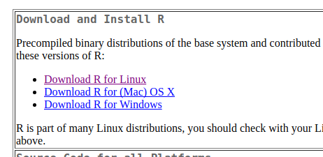
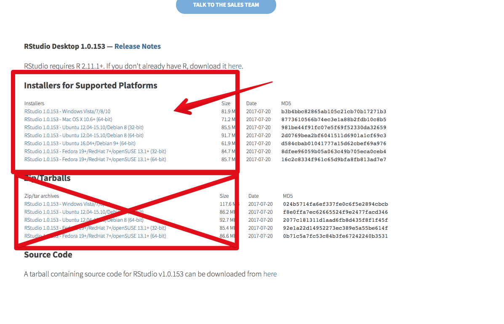

```{r setup, include=FALSE}
source("init.R")
```

# Na, auch hier? {data-background="assets/gifs/welcome.gif" data-background-size="40%"}

## Wer sind wir

<div class="col2">
Tobi  
  

<br />

Lukas  
  
</div>

## Was machen wir hier?

Wir stellen euch **R** vor.

<span class="big"><https://r-intro.tadaa-data.de></span>

<div class="fragment">

</div>


## Ziele des Kurses

- Ihr wisst was R ist und habt RStudio einsatzbereit auf eurem Rechner  
- Umgang mit RStudio
- Vermittlung grundlegenden Vokabulars
- Anwendung von Funktionen und rudimentären Statistiken
- Erweiterung des Funktionsumfangs mit Hilfe von Paketen

## Fahrplan

- Was ist R überhaupt und wozu brauchen wir das?
- Installation
- RStudio: die Arbeitsoberfläche
- R: ein glorifizierter Taschenrechner?
- Die Open Source Community: Pakete & Hilfe bei Problemen


# Was ist R? {data-background="assets/images/RStudio-Ball.png" data-background-size="30%"}

## In erster Linie...

ist R eine Programmiersprache...

<div class="fragment">

</div>

...zur statisischen Datenanalyse (und zunehmend auch Machine Learning).

## Genauer gesagt

- R ist _**kostenlos**_
- Löst seit ~2010 gängige Alternativen ab
- Top-Notch in Analyse und grafischer Darstellung
- Anfangs leider etwas schwierig, danach allerdings wesentlich flexibler und schneller als die Alternativen
- Quasi endlos erweiterbar

## Verbreitung in 2016


## Änderungsrate von 2015 zu 2016


## Aber... aber... Psychologie! 

Menschen, Denken, all das...! Warum sollte ich das können?

- Diese _Statistik_ lässt euch die nächsten 5 Jahre nicht los
- Es wird komplizierter werden als  
$\bar{x} = \frac{1}{n} \sum_{i=1}^{n} {x_i}$ und $\sigma = \frac{1}{n}\sum_{i=1}^n \sqrt{({x_i} - \bar{x})^2}$
- SPSS kostet viele viele Euros; niemand (erst recht nicht die Uni) möchte für schlechte Ware gutes Geld ausgeben
- Für Psychos:
    - Ihr dürft weder Tabellen noch Grafiken aus SPSS in euren Berichten & Arbeiten benutzen
    - Die neuen Profs benutzen **alle** R

## Aber... programmieren...? =C

Klingt schlimmer als es ist. Hauptsächlich, weil ihr schreiben statt klicken werdet.

<div class="fragment">
Das heißt zu Anfang:

```r
# Mittelwert berechnen:
mean(x)

# Median:
median(x)

# Standardabweichung:
sd(x)
```
</div>

## Voodoo

...und später dann:

```r
mtcars %>%
  mutate(am = factor(am, levels = c(0, 1), labels = c("Automatik", "Manuell")),
         consumption = 235 / mpg) %>%
  ggplot(data = ., aes(x = hp, y = consumption, color = am)) +
  geom_smooth(aes(group = 1), method = lm, se = F, color = "gray") +
  geom_point(size = 3, alpha = .7) +
  scale_color_brewer(palette = "Set1") +
  labs(title = "Kraftstoffverbrauch",
       subtitle = "Verbrauch verschiedene PKW nach Leistung und Schaltung",
       x = "Leistung (PS)", y = "Verbrauch (L/100km)", color = "Schaltung")
```

<div class="fragment">

</div>

## ... Aber Schön

```{r, echo=FALSE}
mtcars %>%
  mutate(am = factor(am, levels = c(0, 1), labels = c("Automatik", "Manuell")),
         consumption = 235 / mpg) %>%
  ggplot(data = ., aes(x = hp, y = consumption, color = am)) +
  geom_smooth(aes(group = 1), method = lm, se = F, color = "gray") +
  geom_point(size = 3, alpha = .7) +
  scale_color_brewer(palette = "Set1") +
  labs(title = "Kraftstoffverbrauch",
       subtitle = "Verbrauch verschiedene PKW nach Leistung und Schaltung",
       x = "Leistung (PS)", y = "Verbrauch (L/100km)", color = "Schaltung")
```

## "Motivier doch mal mit Beispielen"

```{r sim_p1a, echo=FALSE}
sim_p1
```

## Man könnte ja…

```{r sim_p1b, echo=FALSE}
sim_p1 + 
  geom_smooth(method = lm, se = FALSE, size = 2)  +
  ggtitle(paste("Pearson's r = ", round(cor(dat$X, dat$Y), 2)))
```

## But then…

```{r sim_p2, echo=FALSE}
sim_p2
```

## There came SCIIEEENCE!

```{r sim_p3, echo=FALSE}
sim_p3
```


# Installation {data-background="assets/gifs/software_MGdfeiKtEiEPS.gif" data-background-size="40%"}

## Vorbereitung

Siehe auch:  
<https://r-intro.tadaa-data.de/book/installation.html>

- Windows-Leute: ANTIVIRUS DEAKTIVIEREN!

## Schritt 1: **R** selbst

<https://cran.r-project.org/>



## Je nach Betriebssystem sieht's anders aus

<div class="col2">
für Windows:  


<br />

für Mac:  

</div>

## Schritt 2: RStudio

Die Basisinstallation von **R** ist notwendig, benutzen werden wir allerdings die Software **RStudio**.


Muss aber natürlich auch erst installiert werden.

## Zurück ins Internet!

<https://www.rstudio.com/>

"Download RStudio" $\rightarrow$ "FREE License" (ganz links)

<div class="col2">


<br />


</div>

## Gleiches Spiel: Betriebssysteme



## Remember...

<div class="col2">
Wir arbeiten nicht mit _**base R**_...  
  

<br />

...sondern mit _**RStudio**_:  
  
</div>

Sobald ihr das richtige Icon gelöscht und RStudio über das andere geöffnet habt, geht es in die Übung!


# Doch zuerst:<br />**Kurze Installationspause!** {data-background="assets/gifs/install_break.gif" data-background-size="20%" data-background-position="50% 70%"}

## Für später:

Die Datensätze: https://data.tadaa-data.de 
